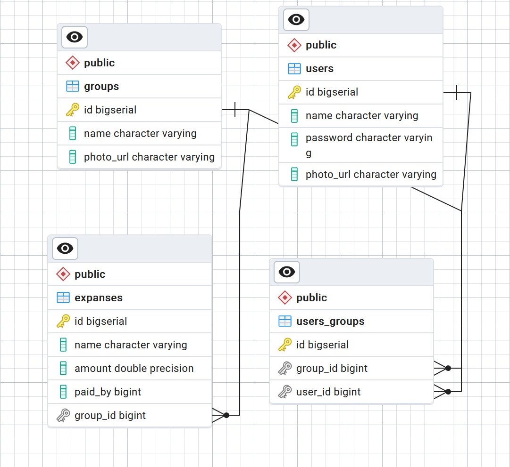
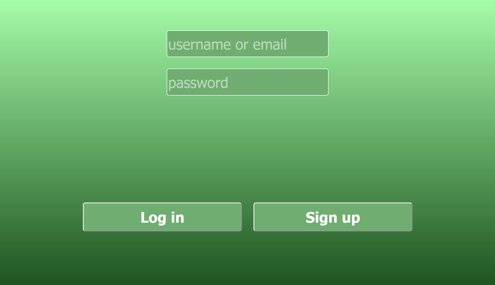
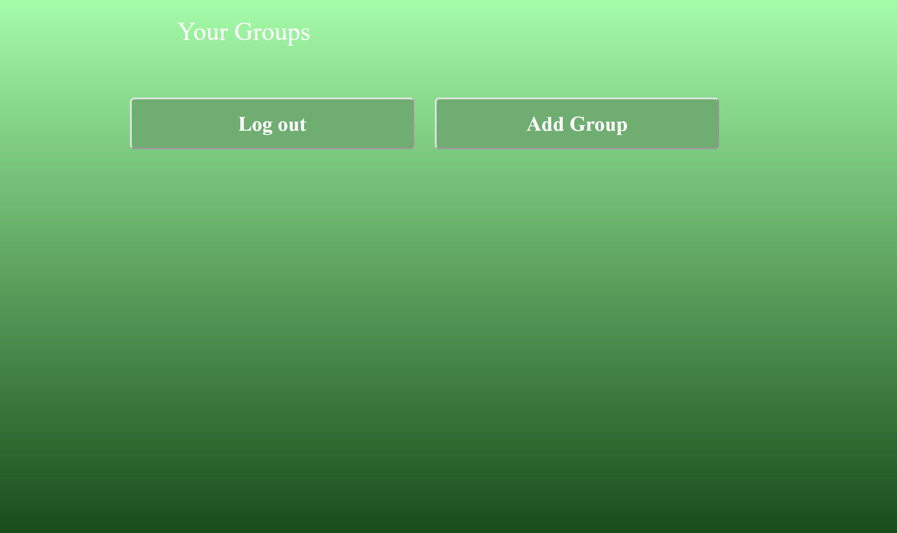
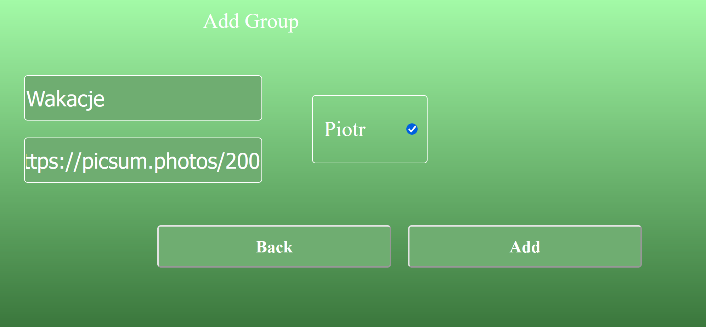
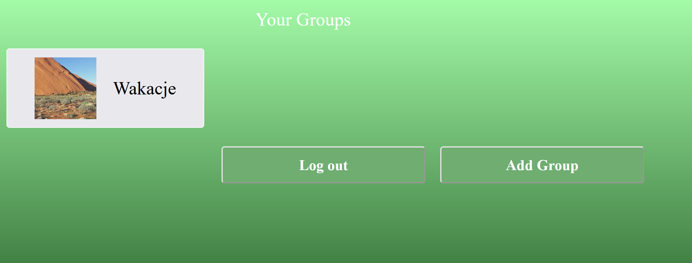
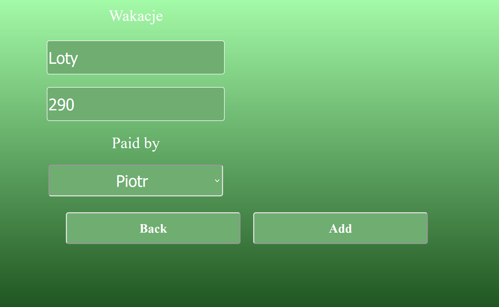
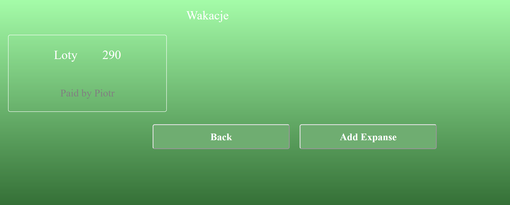

# Split with me

## About
The application allows user to track and manage their expanses and share them with other users.

## Table of contents
* [Features](#features)
* [Technology](#technology)
* [Setup](#setup)
* [ERP Diagram](#erp-diagrm)
* [Demo](#demo)
* [Development](#development)

## Features:
- Sign in new user
- Login in with an existing user
- Add new group of expanses
- Add other users to the group
- Add new expanse to the group
- Set payer of the expanse

## Technology:
- HTML5, 
- CSS, 
- JavaScript (API/AJAX included), 
- PHP, 
- PostgreSQL

## Setup:

To run the application it is necessary to install the docker tool which enables managing the containers.
Then it's necessary to download the snapshot and then run all the containers with docker. \
The database should be available at \
`localhost:5050`\
And the application itself should be available at\
`localhost:8080`

## ERP Diagrm:

## Demo:
After typing `localhost:8080/main` in the browser, the main page will appear. This page allows user to sign up or log in if they already have an account.

At the beginning, there are no groups created, so the view presents only the buttons to log out or to create new group.

We can add new expanses group by clicking the add group button.\
After that we will be redirected to new page.
Here we can type in the name of the group and choose which users should be included in the group.

After clicking the Add button we will be redirected back to the user page, where we will see our recently created group.

Then we can click on the group to see its expanses. 

At the beginning the group is empty, but we can click the add expanse button to create new expanse.\
Then we will be redirected to the next page, where we can specify the name, amount and the payer of the expanse.

As the result we will see the new expanse in the group page.

At the end we can log out.
## Development:

The application can be developed. The first feature to be added should be possibility to choose users between which the specific expanse should be splited.
Another idea is to create another view for the user with balances calculated per user.
Next feature would be possibility to clean the balance. And another functionality is to enable editing and deleting expanses and groups.